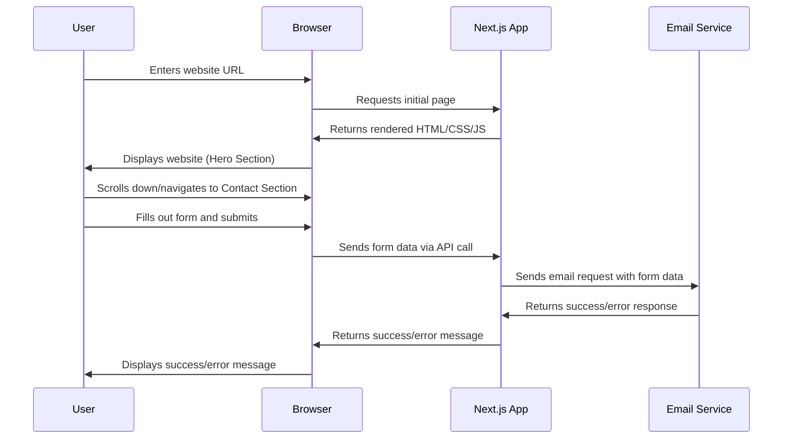

Okay, here's the system flow documentation for your animated Next.js portfolio website, focusing on user experience, mailing logic, and error handling:

```markdown
# Portfolio Website System Flow Documentation

This document outlines the system flow for a highly animated and visually appealing personal portfolio website built with Next.js, utilizing a dark, cohesive theme. The website will feature a hero section, about section, tech stack, experience, projects, and a contact form with mailing capabilities. No database is used; all data is statically rendered.

## 1. User Workflows

This section describes the primary user journeys through the website.  Animations and smooth transitions will be key elements in each workflow.

*   **Workflow 1: Initial Landing & Exploration:**
    *   User lands on the website's homepage (Hero section).
    *   The Hero section likely contains a brief introduction and a call to action (e.g., "View my work").
    *   User scrolls down to view the "About" section, learning about the portfolio owner's background and skills.
    *   User continues scrolling to explore "Tech Stack" (skills), "Experience", and "Projects" sections.  Animations will highlight each section as it comes into view.
    *   User may use the navigation menu to jump directly to a specific section.

*   **Workflow 2: Contacting the Portfolio Owner:**
    *   User navigates to the "Contact Us" section.
    *   User fills out the contact form (name, email, message).
    *   User submits the form.
    *   The system displays a success or error message (see Error Handling section).
    *   (Behind the scenes) The form data is sent to an email service for processing.

*   **Workflow 3: Viewing Project Details (If applicable):**
    *   User clicks on a project card or link.
    *   A modal or separate page displays detailed information about the selected project (description, technologies used, links to demo/code).
    *   User can close the modal or navigate back to the projects overview.



## 2. Data Flows

This section details how data moves through the system, focusing on the contact form submission process.  All other website content is statically rendered and doesn't involve complex data flows.

*   **Data Flow 1: Contact Form Submission**
    *   User input (Name, Email, Message) is entered into the contact form on the client-side.
    *   Upon submission, the form data is packaged as a JSON object.
    *   This JSON data is sent as a POST request to a Next.js API route (e.g., `/api/contact`).
    *   The API route processes the data (validation, sanitization).
    *   The API route utilizes a mailing library (e.g., Nodemailer, SendGrid) to send an email to the portfolio owner.
    *   The mailing library interacts with an email service provider (e.g., Gmail, SendGrid, Mailgun).
    *   The email service provider sends the email.
    *   The API route receives a success or error response from the mailing library.
    *   The API route returns a JSON response to the client (success or error message).
    *   The client-side JavaScript displays the appropriate message to the user.

```mermaid
graph LR
    A[User Input (Form)] --> B(Next.js Client-Side);
    B -- POST Request --> C[/api/contact API Route/];
    C --> D[Mailing Library (e.g., Nodemailer)];
    D --> E((Email Service Provider (e.g., Gmail)));
    E --> F[Portfolio Owner's Inbox];
    E -- Success/Error --> D;
    D --> C;
    C -- JSON Response --> B;
    B --> A;
    style E fill:#f9f,stroke:#333,stroke-width:2px
```

## 3. Integration Points

This section describes how the different components of the website integrate with each other.

*   **Next.js Components:**
    *   **Hero Component:**  Integrated directly into the homepage.  Receives no external data (static content).
    *   **About Component:** Integrated directly into the homepage. Receives no external data (static content).
    *   **Tech Stack Component:** Integrated directly into the homepage.  Receives no external data (static content).  Might use a mapping function to iterate through an array of technologies.
    *   **Experience Component:** Integrated directly into the homepage.  Receives no external data (static content).  Likely uses a mapping function to iterate through an array of experience objects.
    *   **Projects Component:** Integrated directly into the homepage.  Receives no external data (static content).  Likely uses a mapping function to iterate through an array of project objects. Could also potentially use `next/image` to optimize project thumbnails.
    *   **Contact Us Component:** Contains the contact form. Triggers the `Data Flow 1` (Contact Form Submission) when the form is submitted.
    *   **API Route (/api/contact):**  Receives form data from the Contact Us component.  Sends email using a mailing library.  Returns success/error messages.

*   **Mailing Library (e.g., Nodemailer, SendGrid):** Integrated into the `/api/contact` API route. Handles the email sending logic. Requires configuration with email service provider credentials.

*   **Email Service Provider (e.g., Gmail, SendGrid, Mailgun):** Provides the infrastructure for sending emails. Requires an account and API key/credentials.  Free tiers often have limitations on the number of emails that can be sent per month.

## 4. Error Handling

This section describes how errors are handled at various points in the system.

*   **Client-Side Form Validation:**
    *   Implement client-side JavaScript validation to ensure that required fields (name, email, message) are filled out correctly before submitting the form.
    *   Validate email format using regular expressions.
    *   Display clear and helpful error messages to the user directly within the form (e.g., "Please enter your name," "Please enter a valid email address").

*   **Server-Side Validation (API Route):**
    *   **Essential:** Re-validate all form data on the server-side within the `/api/contact` API route. This is crucial for security, as client-side validation can be bypassed.
    *   Sanitize the data to prevent XSS (Cross-Site Scripting) attacks. Libraries like `DOMPurify` can be useful.
    *   Check for spam and potentially implement rate limiting to prevent abuse.

*   **Mailing Library Errors:**
    *   Wrap the email sending logic in a `try...catch` block within the API route.
    *   Handle potential errors from the mailing library (e.g., connection errors, authentication failures, invalid email addresses).
    *   Log these errors to a server-side logging service (e.g., console.log, a dedicated logging library like Winston or Pino - though not persisting anywhere in this case, useful for dev).

*   **Email Service Provider Errors:**
    *   The mailing library will often provide error codes and messages from the email service provider.  Make sure these are handled and logged appropriately.

*   **Generic API Route Error Handling:**
    *   Implement a general error handler in the `/api/contact` route to catch unexpected exceptions.
    *   Return a 500 Internal Server Error response with a generic error message to the client (e.g., "An error occurred while processing your request. Please try again later."). *Do not* expose sensitive error details to the client.

*   **Client-Side Error Display:**
    *   If the API route returns an error, display a user-friendly error message to the user (e.g., "Sorry, there was a problem sending your message. Please try again later.").
    *   Avoid displaying technical error details to the user.

*   **Example Error Handling in `/api/contact`:**

    ```javascript
    // /pages/api/contact.js
    import nodemailer from 'nodemailer';
    import { sanitize } from 'dompurify';

    export default async function handler(req, res) {
      if (req.method === 'POST') {
        const { name, email, message } = req.body;

        // Server-side validation & Sanitization
        if (!name || !email || !message) {
          return res.status(400).json({ error: 'Please fill in all fields.' });
        }

        const sanitizedName = sanitize(name);
        const sanitizedEmail = sanitize(email);
        const sanitizedMessage = sanitize(message);

        // Configure Nodemailer (replace with your email settings)
        const transporter = nodemailer.createTransport({
          service: 'gmail',
          auth: {
            user: 'your-email@gmail.com', // Your Gmail address
            pass: 'your-password', // Your Gmail password or App Password
          },
        });

        const mailOptions = {
          from: sanitizedEmail,
          to: 'your-email@gmail.com', // Your Gmail address
          subject: `Portfolio Contact Form Submission from ${sanitizedName}`,
          text: sanitizedMessage,
          html: `<p>Name: ${sanitizedName}</p><p>Email: ${sanitizedEmail}</p><p>Message: ${sanitizedMessage}</p>`,
        };

        try {
          await transporter.sendMail(mailOptions);
          return res.status(200).json({ success: 'Message sent successfully!' });
        } catch (error) {
          console.error('Error sending email:', error); // Log the error
          return res
            .status(500)
            .json({ error: 'Failed to send message. Please try again later.' });
        }
      } else {
        res.status(405).json({ error: 'Method Not Allowed' });
      }
    }
    ```

This documentation provides a solid foundation for building your animated portfolio website. Remember to prioritize a smooth and engaging user experience, implement robust error handling, and carefully consider the limitations of free email service tiers. Good luck!
